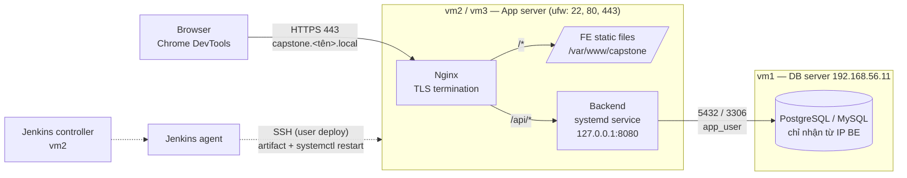
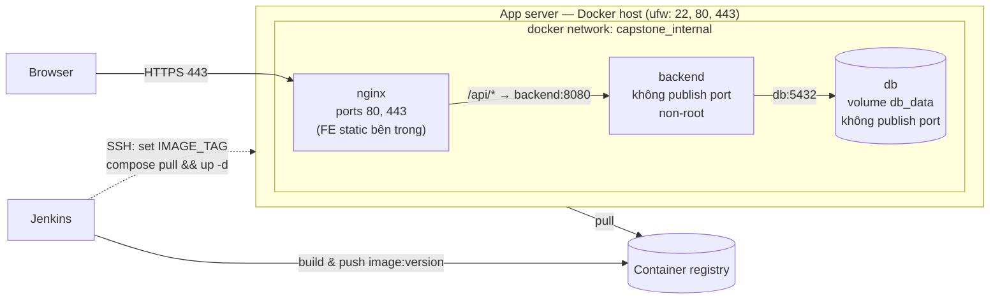

# 09 — Capstone: Triển khai hệ thống 3 tầng end-to-end

> **Hình thức:** làm cá nhân, demo cuối khóa

Capstone tổng hợp toàn bộ kiến thức module 01–08. Bạn tự chuẩn bị một ứng dụng gồm Backend, Frontend, Database, triển khai bằng **2 cách** (Linux thuần và Docker), bảo vệ bằng HTTPS, tự động hóa bằng Jenkins và có cơ chế rollback.

Tài liệu đi kèm:
- [self-checklist.md](self-checklist.md) — checklist tự rà soát theo từng hạng mục trước khi demo
- [demo-checklist.md](demo-checklist.md) — hướng dẫn chuẩn bị demo và câu hỏi tự kiểm tra
- [devtools-checklist.md](devtools-checklist.md) — dùng Chrome DevTools kiểm tra request FE → BE

## 1. Đề bài

### 1.1. Source code (tự chuẩn bị)
- **1 Backend**: Python Flask, .NET hoặc Java Spring Boot (có thể phát triển tiếp app ở module 04). Tối thiểu:
  - `GET /api/health` — trả trạng thái app **và** kết nối DB
  - CRUD 1 resource (VD `/api/employees`) đọc/ghi DB thật
  - Đọc toàn bộ cấu hình (DB host, user, password, port…) từ biến môi trường
- **1 Frontend**: React, Vue hoặc Angular (có thể dùng app Vite ở module 06). Có trang danh sách + form thêm/sửa gọi BE qua đường dẫn tương đối `/api/...` (không hardcode host/port).
- **1 Database**: PostgreSQL hoặc MySQL.
  - Tách user: `app_user` (chỉ quyền `SELECT/INSERT/UPDATE/DELETE` trên schema của app), `migration_user` (quyền DDL trên schema), `readonly_user` (chỉ `SELECT`). Không app nào dùng superuser.
  - DB chỉ chấp nhận kết nối từ IP của server BE (`pg_hba.conf`/`bind-address` + firewall).
  - Có script backup tự động hằng ngày (cron/systemd timer) và hướng dẫn restore đã được thử.

> Bạn cần giải thích được từng `GRANT`: vì sao user đó cần quyền đó và vì sao không cần nhiều hơn. Ghi lại trong `docs/decisions.md`.

### 1.2. Triển khai bằng 2 cách

**Cách 1 — Linux thuần (systemd + Nginx)**
- BE chạy bằng **systemd service** với user hệ thống riêng (không login shell), tự restart khi crash, log vào journald.
- FE build ra static file, Nginx serve.
- Nginx làm reverse proxy cho BE.

**Cách 2 — Docker / Docker Compose**
- Dockerfile multi-stage cho BE và FE, image chạy bằng non-root user.
- `docker-compose.yml` gồm `nginx` (hoặc FE image có Nginx), `backend`, `db` (DB có thể dùng container hoặc tiếp tục dùng DB trên vm1 — ghi rõ lựa chọn).
- Network nội bộ: chỉ Nginx publish cổng ra host; BE và DB không publish port.
- Volume cho dữ liệu DB, healthcheck cho các service, `depends_on` với `condition: service_healthy`.

### 1.3. HTTPS và một endpoint duy nhất
- Tạo **self-signed certificate** (tốt hơn: tự tạo CA nội bộ rồi ký cert cho domain, import CA vào máy client).
- Domain lab, VD `https://capstone.<tên>.local` (khai báo trong `/etc/hosts` của client).
- Chỉ dùng **1 endpoint** cho cả FE và BE:
  - `https://capstone.<tên>.local/api/*` → Backend
  - `https://capstone.<tên>.local/*` → Frontend (SPA fallback về `index.html`)
- HTTP (80) redirect sang HTTPS (443). Tắt TLS 1.0/1.1. Thêm header bảo mật cơ bản (HSTS, `X-Content-Type-Options`, `X-Frame-Options`).
- Vì cùng origin nên **không cần CORS** — giải thích được tại sao.

### 1.4. CI/CD với Jenkins
- Pipeline tự động khi push `main`: build → test → đóng gói (artifact + Docker image có version) → push registry → deploy **tất cả service** (BE, FE, migration DB) → smoke test.
- Hỗ trợ deploy theo cả 2 cách (parameter chọn `systemd` / `compose`, hoặc 2 pipeline riêng).
- Có approval trước khi deploy "production".
- Không secret nào trong repo hoặc console log; tất cả qua Jenkins Credentials.

### 1.5. Quản lý version & rollback
- Mỗi lần deploy có version duy nhất (semver + build number / git sha), truy vết được: version nào, commit nào, ai deploy, lúc nào.
- Lịch sử deploy lưu trên server (hoặc nơi khác bạn đề xuất).
- **Rollback tự động** khi smoke test fail; **rollback thủ công** về version bất kỳ trong 5 version gần nhất.
- Có chiến lược cho DB migration khi rollback (expand/contract hoặc migration có `down` đã kiểm thử).

### 1.6. Chrome DevTools
- Dùng DevTools chứng minh được luồng request FE → Nginx → BE: status code, headers, payload, thời gian, certificate.
- Nhận diện và giải thích được các lỗi thường gặp — xem [devtools-checklist.md](devtools-checklist.md).

### 1.7. Yêu cầu phi chức năng
- **Không commit secret**: dùng `.env.example`, Jenkins Credentials; `.gitignore` đầy đủ.
- **Least privilege**: mỗi service chạy bằng user riêng; user `deploy` có sudo giới hạn; DB user tách quyền.
- **Firewall**: server ứng dụng chỉ mở `22`, `80`, `443`; DB server chỉ mở cổng DB cho IP BE và `22`. SSH tắt đăng nhập bằng password và đăng nhập root.
- **Log**: log Nginx (access/error) có rotate; log BE xem được qua `journalctl` (cách 1) và `docker compose logs` (cách 2); log có timestamp, không ghi password/token.
- **Tài liệu**: người khác đọc README phải dựng lại được toàn bộ hệ thống.

## 2. Kiến trúc

### Cách 1 — Linux thuần



### Cách 2 — Docker Compose



## 3. Milestones

| Mốc | Mục tiêu | Deliverable (PR khi hoàn thành mốc) |
|------|----------|-------------------------------|
| **1** | Source code + DB + deploy Linux thuần | App BE/FE chạy local; DB trên vm1 với 3 user tách quyền, giới hạn IP, backup/restore đã thử; BE chạy bằng systemd, FE + reverse proxy qua Nginx (HTTP) |
| **2** | HTTPS + Docker | Cert self-signed/CA nội bộ, 1 endpoint `/api/*` & `/*`, redirect HTTP→HTTPS, header bảo mật; Dockerfile multi-stage, compose chạy được với cùng endpoint HTTPS |
| **3** | CI/CD | Jenkins pipeline build → test → image có version → push registry → deploy cả 2 cách → smoke test; approval production |
| **4** | Version, rollback, hoàn thiện | Lịch sử deploy, rollback tự động + thủ công, chiến lược migration; DevTools report; firewall/log/hardening; README hoàn chỉnh; tập dượt demo |

Làm lần lượt từng mốc theo tiến độ của bạn; xong mốc nào tạo PR deliverable của mốc đó trong repo cá nhân để được review.

## 4. Cấu trúc repo nộp bài

Nộp trong repo cá nhân, tại `devops-training/09-capstone/` (hoặc một repo cá nhân riêng cho capstone, link từ `devops-training/README.md`):

```
09-capstone/
├── README.md                 # Tổng quan, kiến trúc, hướng dẫn dựng lại từ đầu
├── app/
│   ├── backend/              # Source BE + Dockerfile + test
│   ├── frontend/             # Source FE + Dockerfile
│   └── db/
│       ├── migrations/
│       ├── init/             # Tạo DB, user, GRANT (không chứa password thật)
│       └── backup/           # backup.sh, restore.sh, systemd timer/cron
├── deploy/
│   ├── linux/
│   │   ├── systemd/          # <app>.service
│   │   ├── nginx/            # site config, snippet TLS
│   │   └── scripts/          # deploy.sh, rollback.sh
│   └── docker/
│       ├── docker-compose.yml
│       ├── nginx/
│       └── .env.example
├── jenkins/
│   ├── Jenkinsfile
│   └── Jenkinsfile.rollback
├── certs/
│   └── README.md             # Cách tạo cert — KHÔNG commit private key
└── docs/
    ├── architecture.md
    ├── runbook.md            # Deploy, rollback, restore DB, xử lý sự cố thường gặp
    ├── devtools-report.md    # Ảnh chụp + giải thích theo devtools-checklist
    └── decisions.md          # Các lựa chọn kỹ thuật và lý do
```

## 5. Tiêu chí hoàn thành

Trước khi demo, tự rà toàn bộ [self-checklist.md](self-checklist.md) và chuẩn bị theo [demo-checklist.md](demo-checklist.md). Capstone được xem là hoàn thành khi:
- Mọi mục bắt buộc trong `self-checklist.md` đã được tick và bạn chứng minh được trên hệ thống thật.
- Bạn demo trực tiếp được luồng **deploy version mới** và **deploy lỗi → rollback**.
- Không mắc các lỗi nghiêm trọng: commit secret, chạy app bằng root, dùng superuser DB cho app, `chmod 777`, tắt firewall để "cho chạy được", push code lên nơi không được phép ([00-onboarding](../00-onboarding/README.md)).
- Bạn giải thích được mọi thứ mình đã nộp.
